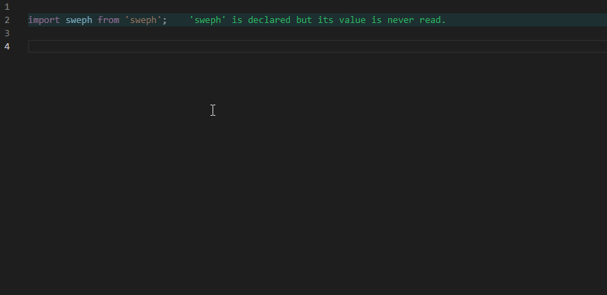

# Sweph

The definitive Swiss Ephemeris bindings for Node.js  
Everything you need to create Astrology and Astronomy applications with javascript and node.js

* 100% API coverage
* Built-in Typescript declarations
* Built-in intellisense documentation
* Version matching
* Made with the N-API

[Official documentation for the Swiss Ephemeris by Astrodienst AG](https://www.astro.com/swisseph/swephprg.htm)  
[Sweph on NPM](http://npm.com/package/sweph)

## Installation and Licensing

This library follows the licensing requirements for the Swiss Ephemeris by Astrodienst AG.

### GPL

Up to and including version `2.10.01`, this library is licensed under `GPL-2.0`.  
To install and use this library under GPL, use `npm install sweph@2.10.01`.

### AGPL

Starting from version `2.10.1` and later, this library is licensed under `AGPL-3.0`.  
To install and use the latest version of this library under AGPL, use `npm install sweph`.

### LGPL

If you own a professional license for the Swiss Ephemeris, you may use any version of this library under `LGPL-3.0`.

## Versioning

This library is version locked to the Swiss Ephemeris in addition to its own revisions. For example, version `2.10.1-1` corresponds to the Swiss Ephemeris version `2.10.1` and this library's revision `1`.

Updates to this library will be released under new revisions, while updates to the upstream Swiss Ephemeris will be released under matching semver versions.

## Documentation

This library is fully typed and documented via intellisense. To access its documentation simply hover over its functions:

## Contributing

If you find any innacuracy or bug in this library, or if you find an update that is not yet included in this library, feel free to open an issue or a pull request.

## Known Issues and Caveats

* Due to how the underlying C library operates, you may find that the `error` field returned by some functions will contain data even if there is no actual error. This can happen when existing memory buffers are recycled and the user must handle it by also checking the returned flag values as per the Swiss Ephemeris documentation.
* While worker_threads are supported, the underlying C library is single threaded and its settings are global. Functions such as `set_ephe_path()` will affect the entire process, including worker_threads. While you can still use worker_threads as long as you dont change settings from other threads in the middle of calculations, true thead-safe multithreading can be achieved using child_process instead.
